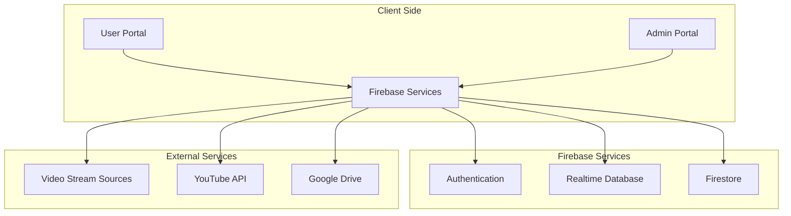
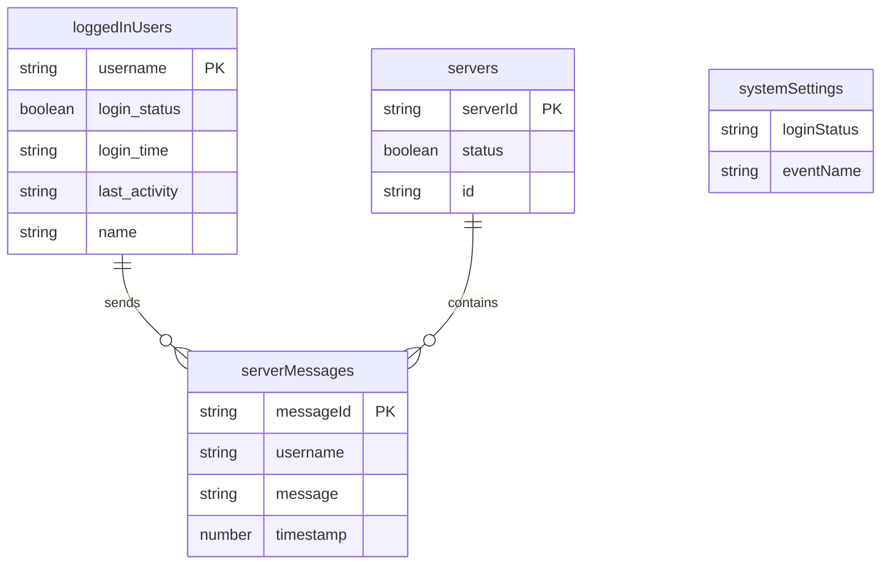
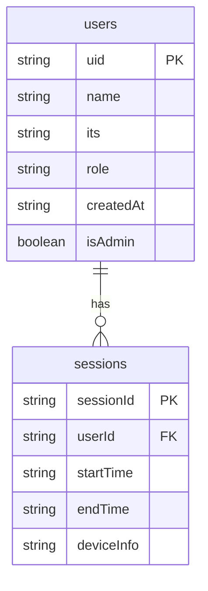
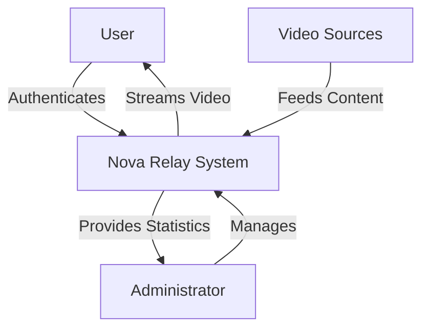
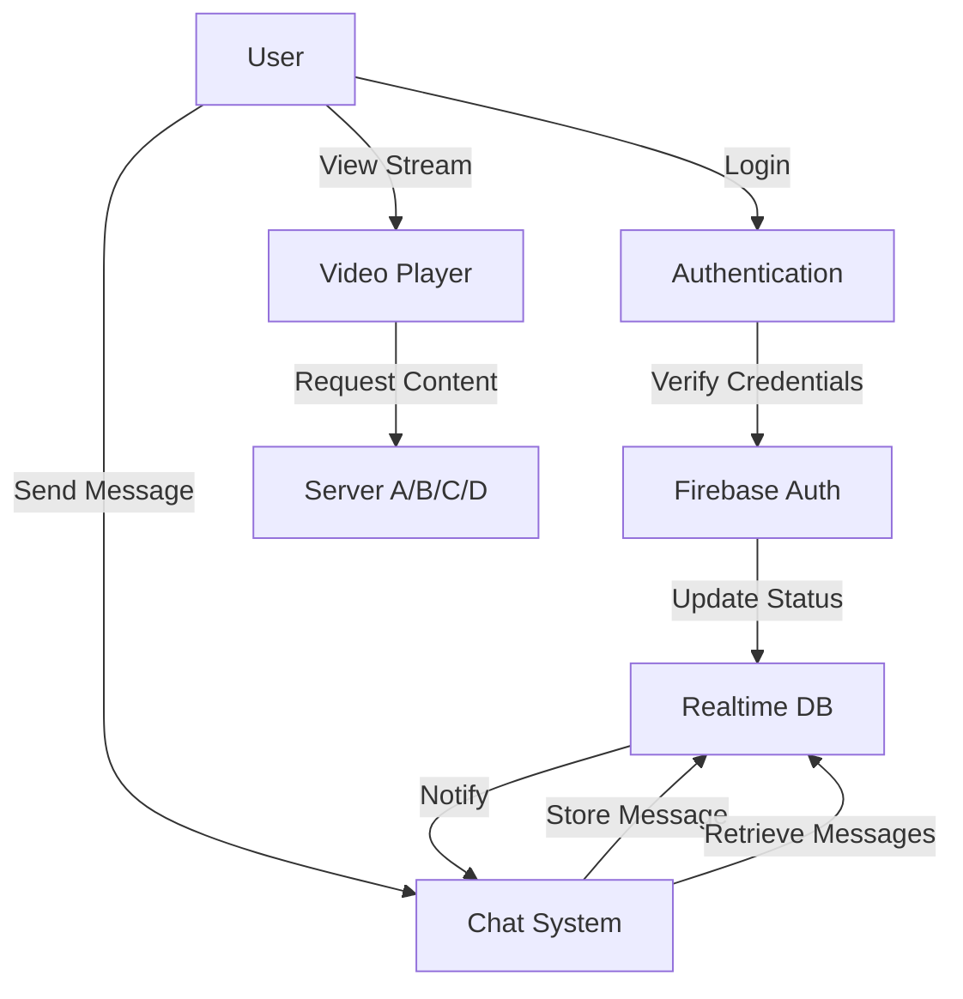
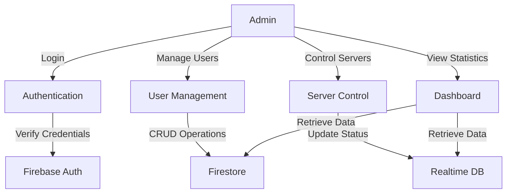
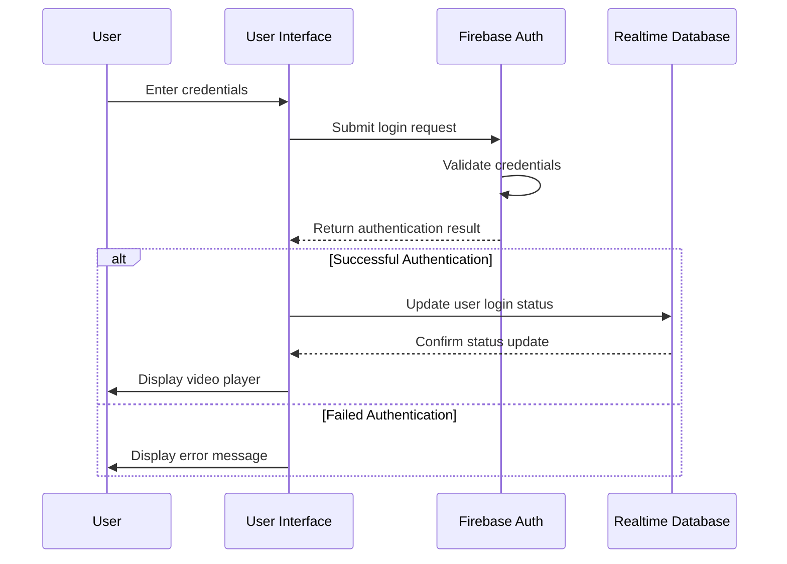
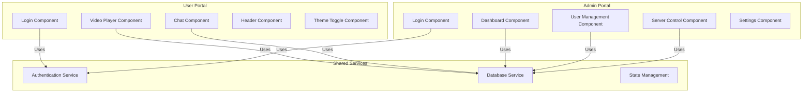

# Nova Relay: Video Streaming Web Application
 Application Development Project Report

---

 Table of Contents

1. [Project Objectives](#1-project-objectives)
2. [Introduction](#2-introduction)
3. [Existing System](#3-existing-system)
4. [Proposed System](#4-proposed-system)
5. [System Requirements](#5-system-requirements)
   - 5.1 [Functional Requirements](#51-functional-requirements)
   - 5.2 [Non-Functional Requirements](#52-non-functional-requirements)
   - 5.3 [Hardware Requirements](#53-hardware-requirements)
   - 5.4 [Software Requirements](#54-software-requirements)
6. [Feasibility Study](#6-feasibility-study)
   - 6.1 [Technical Feasibility](#61-technical-feasibility)
   - 6.2 [Economic Feasibility](#62-economic-feasibility)
   - 6.3 [Operational Feasibility](#63-operational-feasibility)
7. [System Design](#7-system-design)
   - 7.1 [Architecture Design](#71-architecture-design)
   - 7.2 [Database Design](#72-database-design)
   - 7.3 [User Interface Design](#73-user-interface-design)
8. [Data Flow Diagrams / ER Diagrams / UML Diagrams](#8-data-flow-diagrams--er-diagrams--uml-diagrams)
9. [Implementation Details](#9-implementation-details)
   - 9.1 [Technology Stack](#91-technology-stack)
   - 9.2 [Implementation Methodology](#92-implementation-methodology)
   - 9.3 [Key Components](#93-key-components)
10. [Testing](#10-testing)
    - 10.1 [Unit Testing](#101-unit-testing)
    - 10.2 [Integration Testing](#102-integration-testing)
    - 10.3 [System Testing](#103-system-testing)
    - 10.4 [User Acceptance Testing](#104-user-acceptance-testing)
11. [Results](#11-results)
12. [Conclusion](#12-conclusion)
13. [References](#13-references)

---

 1. Project Objectives

The primary objectives of the Nova Relay video streaming web application are:

1. To develop a secure and reliable platform for live video streaming and broadcasting
2. To create separate portals for users and administrators with distinct functionalities
3. To implement real-time communication features including chat functionality
4. To provide multiple server options for video streaming to ensure reliability
5. To establish a comprehensive user management system for administrators
6. To create a responsive and intuitive user interface for both portals
7. To implement authentication and authorization mechanisms
8. To enable system administrators to control server status and login permissions

 2. Introduction

Nova Relay is a modern web-based video streaming application designed to facilitate live broadcasts for educational and organizational purposes. The application consists of two main components: a user portal for viewers to access live streams and an administrative portal for managing users, servers, and system settings.

The system leverages real-time database capabilities to provide seamless streaming experiences across multiple server options, allowing users to switch between servers based on availability and performance. The application also incorporates a real-time chat feature, enabling viewers to communicate during broadcasts.

Nova Relay addresses the growing need for reliable, secure, and user-friendly video streaming solutions in educational and organizational contexts. By providing multiple server options and comprehensive administrative controls, the system ensures high availability and adaptability to various streaming requirements.

 3. Existing System

Traditional video broadcasting systems often face several limitations:

1. Limited Accessibility: Many existing systems require specialized hardware or software, limiting access to specific devices or locations.
2. Single Point of Failure: Traditional broadcasting systems typically rely on a single server or transmission method, creating vulnerability to outages.
3. Limited Administrative Control: Existing systems often lack comprehensive administrative tools for user management and system configuration.
4. Minimal User Interaction: Many broadcasting platforms provide limited or no options for real-time viewer interaction.
5. Complex User Interfaces: Traditional systems frequently feature complex interfaces that require technical expertise to operate.
6. Inadequate Security Measures: Existing systems may lack robust authentication and authorization mechanisms.

These limitations create challenges for organizations seeking to implement reliable and accessible video broadcasting solutions, particularly in educational contexts where ease of use and reliability are paramount.

 4. Proposed System

Nova Relay addresses the limitations of existing systems through a comprehensive web-based solution with the following key features:

1. Dual Portal Architecture:
   - User Portal: Provides viewers with access to live streams, chat functionality, and server selection options
   - Admin Portal: Offers comprehensive tools for user management, server control, and system configuration

2. Multi-Server Streaming:
   - Support for multiple streaming servers (A, B, C, D)
   - Automatic server status monitoring
   - User ability to switch between available servers

3. Real-Time Communication:
   - Integrated chat system for viewer interaction
   - Unread message notifications
   - Message history preservation

4. Comprehensive User Management:
   - User registration and authentication
   - Online status tracking
   - Inactivity detection and automatic logout
   - User search and filtering capabilities

5. System Control Features:
   - Server activation/deactivation
   - Login status control
   - Event name configuration
   - System health monitoring

6. Responsive Design:
   - Adaptive interface for various device sizes
   - Light/dark theme support
   - Accessibility considerations

7. Security Measures:
   - Firebase Authentication integration
   - Role-based access control
   - Password management features
   - Session tracking and management

 5. System Requirements

# 5.1 Functional Requirements

 User Portal Requirements:
1. User authentication (login/logout)
2. Video stream viewing from multiple server sources
3. Server switching capability
4. Real-time chat participation
5. Theme toggling (light/dark)
6. Unread message notifications
7. Automatic session management

 Admin Portal Requirements:
1. Admin authentication
2. Dashboard with system statistics
3. User management (create, view, update, delete)
4. Server control (enable/disable, configure)
5. System settings management
6. Event name configuration
7. Login status control
8. Profile and password management

# 5.2 Non-Functional Requirements

1. Performance:
   - Video streaming with minimal latency
   - Real-time database updates within 1 second
   - Support for concurrent users

2. Security:
   - Secure authentication mechanisms
   - Data encryption
   - Protection against common web vulnerabilities

3. Usability:
   - Intuitive user interface
   - Responsive design for various devices
   - Accessibility compliance

4. Reliability:
   - High availability (99.9% uptime)
   - Graceful error handling
   - Multiple server options for redundancy

5. Scalability:
   - Support for increasing user base
   - Ability to add additional servers

# 5.3 Hardware Requirements

Server Requirements:
- Modern web server with minimum 4GB RAM
- 50GB storage capacity
- High-bandwidth network connection

Client Requirements:
- Any device with a modern web browser
- Minimum 2GB RAM
- Stable internet connection (minimum 5 Mbps)

# 5.4 Software Requirements

Development Environment:
- Node.js (v14+)
- npm or yarn package manager
- Git version control

Frontend:
- React.js framework
- HTML5, CSS3, JavaScript
- React Router for navigation
- Plyr for video playback

Backend:
- Firebase Authentication
- Firebase Realtime Database
- Firebase Firestore

Deployment:
- Web hosting service with HTTPS support
- Domain name registration

 6. Feasibility Study

# 6.1 Technical Feasibility

The Nova Relay application is technically feasible due to the following factors:

1. Technology Maturity: The project utilizes established technologies (React, Firebase) with extensive documentation and community support.

2. Development Expertise: The required skills for development are widely available, and the technology stack is commonly used in web application development.

3. Integration Capabilities: Firebase provides seamless integration for authentication, real-time database, and cloud storage requirements.

4. Scalability: The chosen technologies support scalable applications capable of handling increasing user loads.

5. Cross-Platform Compatibility: Web-based implementation ensures accessibility across various devices and operating systems.

The technical risks are minimal and primarily relate to video streaming performance optimization and real-time database synchronization, both of which can be addressed through proper implementation and testing.

# 6.2 Economic Feasibility

The economic feasibility of Nova Relay is supported by:

1. Development Costs:
   - Utilization of open-source frameworks reduces licensing costs
   - Firebase offers a generous free tier for initial development and testing
   - Development can be completed with a small team

2. Operational Costs:
   - Cloud-based hosting with pay-as-you-go pricing
   - Minimal maintenance requirements
   - Scalable infrastructure that grows with usage

3. Return on Investment:
   - Improved accessibility to educational content
   - Reduced need for physical attendance
   - Enhanced communication capabilities
   - Potential for monetization through subscription models

The initial investment primarily covers development time and basic cloud service costs, with operational expenses scaling proportionally to usage.

# 6.3 Operational Feasibility

Nova Relay demonstrates strong operational feasibility:

1. User Acceptance: The intuitive interface and familiar web-based interaction model minimize the learning curve for both administrators and users.

2. Administrative Control: Comprehensive administrative tools enable effective management without requiring technical expertise.

3. Maintenance Requirements: The application architecture facilitates easy updates and maintenance through component-based design.

4. Training Needs: Minimal training is required due to the intuitive design and familiar web interface patterns.

5. Support Structure: The system includes built-in error handling and user feedback mechanisms to facilitate support.

The operational risks are primarily related to user adoption, which can be mitigated through initial training sessions and comprehensive documentation.

 7. System Design

# 7.1 Architecture Design

Nova Relay follows a client-server architecture with React.js for the frontend and Firebase services for the backend. The system is divided into two main applications:

1. User Portal (`broadcast-relay`): Provides video streaming access and chat functionality for viewers
2. Admin Portal (`broadcast-relay-admin`): Offers system management capabilities for administrators

The architecture implements the following key patterns:

1. Component-Based Design: Both portals use React components for modular and reusable UI elements
2. State Management: Local state and props for component-level state, with Firebase for global state
3. Real-Time Updates: Firebase Realtime Database for instant data synchronization
4. Authentication Flow: Firebase Authentication for secure user identity management
5. Protected Routes: Route-based access control for authenticated users

# 7.2 Database Design

Nova Relay utilizes two Firebase database services:

1. Firebase Realtime Database: For real-time data such as user status, server status, and chat messages
2. Firebase Firestore: For structured data like user profiles and system configuration

 Realtime Database Structure:

 Firestore Structure:

# 7.3 User Interface Design

The user interface design follows modern web application principles with responsive layouts, intuitive navigation, and consistent visual elements.

 User Portal UI Components:

1. Login Screen: Authentication form with username/password fields
2. Video Player Area: Primary content display with server selection tabs
3. Chat Panel: Real-time messaging interface with message history
4. Header: Application branding and event information
5. Theme Toggle: Light/dark mode switch
6. Logout Control: Session termination option

 Admin Portal UI Components:

1. Navigation Bar: Links to dashboard, users, servers, and settings
2. Dashboard: System statistics and status indicators
3. User Management: User listing with search, filter, and CRUD operations
4. Server Control: Server status toggles and configuration options
5. Settings: Profile and password management
6. Login/Register Forms: Authentication interfaces for administrators

The UI implements a consistent color scheme, typography, and component styling across both portals while maintaining distinct visual identities appropriate to their functions.

 8. Data Flow Diagrams / ER Diagrams / UML Diagrams

# System Context Diagram

# User Portal Data Flow Diagram

# Admin Portal Data Flow Diagram

# User Authentication Sequence Diagram

# Component Diagram

 9. Implementation Details

# 9.1 Technology Stack

Nova Relay is built using the following technologies:

Frontend:
- React.js: JavaScript library for building user interfaces
- React Router: For navigation and routing
- CSS3: For styling with custom properties for theming
- Plyr: Enhanced HTML5 video player
- React Icons: Icon library for UI elements

Backend:
- Firebase Authentication: User identity management
- Firebase Realtime Database: Real-time data synchronization
- Firebase Firestore: Document database for structured data

Development Tools:
- Create React App: React application bootstrapping
- npm: Package management
- Git: Version control
- ESLint: Code quality enforcement

# 9.2 Implementation Methodology

The development of Nova Relay followed an iterative approach with these key phases:

1. Planning and Requirements Analysis:
   - Identification of user and admin requirements
   - Definition of system architecture
   - Selection of appropriate technologies

2. Design Phase:
   - UI/UX design for both portals
   - Database schema design
   - Component structure planning

3. Implementation Phase:
   - Component-based development
   - Firebase integration
   - Authentication implementation
   - Video player integration
   - Chat functionality development
   - Admin controls implementation

4. Testing Phase:
   - Component testing
   - Integration testing
   - User acceptance testing
   - Performance optimization

5. Deployment and Maintenance:
   - Application deployment
   - Monitoring and bug fixing
   - Feature enhancements

# 9.3 Key Components

 User Portal Components:

1. Login Component (`Login.js`):
   - Handles user authentication
   - Manages login state
   - Provides "Remember Me" functionality
   - Displays login status messages

2. Video Players Component (`VideoPlayers.js`):
   - Manages multiple video sources
   - Provides server switching capability
   - Handles video playback controls
   - Integrates with Plyr for enhanced playback

3. Chat Component (`Chat.js`):
   - Displays real-time messages
   - Handles message sending
   - Manages unread message notifications
   - Auto-scrolls to latest messages

4. Header Component (`Header.js`):
   - Displays application branding
   - Shows current event name
   - Provides contextual information

 Admin Portal Components:

1. Dashboard Component (`Dashboard.js`):
   - Displays system statistics
   - Shows server status
   - Presents user activity metrics
   - Provides system health information

2. User Management Component (`UserManagement.js`):
   - Lists registered users
   - Provides user search and filtering
   - Handles user creation and deletion
   - Manages user session control

3. Server Control Component (`ServerControl.js`):
   - Manages server status
   - Configures server IDs
   - Controls system login status
   - Sets event name

4. Settings Component (`Settings.js`):
   - Handles profile updates
   - Manages password changes
   - Provides system configuration options

5. Protected Route Component (`ProtectedRoute.js`):
   - Implements route-based authentication
   - Redirects unauthenticated users
   - Secures admin portal access

 10. Testing

# 10.1 Unit Testing

Unit testing focused on individual components and functions to ensure they operate correctly in isolation:

1. Authentication Functions:
   - Login functionality
   - Registration process
   - Password validation
   - Session management

2. UI Components:
   - Form submissions
   - Button actions
   - Input validation
   - State management

3. Utility Functions:
   - Data formatting
   - Error handling
   - Authentication helpers
   - Time-based operations

# 10.2 Integration Testing

Integration testing verified the correct interaction between components and external services:

1. Authentication Flow:
   - Login to dashboard navigation
   - Session persistence
   - Logout functionality
   - Protected route enforcement

2. Database Operations:
   - User data retrieval and storage
   - Real-time updates
   - Concurrent modifications
   - Error recovery

3. Video Player Integration:
   - Server switching
   - Video source loading
   - Player controls
   - Error handling

4. Chat System:
   - Message sending and receiving
   - Real-time updates
   - Notification system
   - User identification

# 10.3 System Testing

System testing evaluated the application as a whole:

1. End-to-End Workflows:
   - Complete user journey from login to logout
   - Admin management operations
   - Server control processes
   - Settings modifications

2. Performance Testing:
   - Response time measurement
   - Concurrent user simulation
   - Resource utilization monitoring
   - Bandwidth consumption analysis

3. Security Testing:
   - Authentication bypass attempts
   - Input validation testing
   - Session management verification
   - Access control enforcement

4. Compatibility Testing:
   - Cross-browser functionality
   - Responsive design verification
   - Device compatibility checks
   - Network condition simulation

# 10.4 User Acceptance Testing

User acceptance testing involved actual users to validate the application meets requirements:

1. Admin Portal Testing:
   - User management functionality
   - Server control operations
   - Dashboard information accuracy
   - Settings modification effectiveness

2. User Portal Testing:
   - Video playback quality
   - Server switching functionality
   - Chat system usability
   - Theme toggling effectiveness

3. Usability Evaluation:
   - Navigation intuitiveness
   - Error message clarity
   - Feature discoverability
   - Overall user satisfaction

 11. Results

The implementation of Nova Relay has yielded significant results:

1. Enhanced Accessibility:
   - Web-based platform accessible from any device with a browser
   - Multiple server options ensuring content availability
   - Intuitive interface requiring minimal technical knowledge

2. Improved Administrative Control:
   - Comprehensive dashboard for system monitoring
   - Streamlined user management capabilities
   - Flexible server configuration options
   - Real-time system status visibility

3. Enhanced User Experience:
   - Seamless video playback with server switching options
   - Integrated chat functionality for viewer interaction
   - Theme customization for visual preference
   - Responsive design for various device sizes

4. Robust Security Implementation:
   - Secure authentication mechanisms
   - Role-based access control
   - Inactivity detection and automatic logout
   - Password management capabilities

5. System Reliability:
   - Multiple server options for redundancy
   - Real-time status monitoring
   - Graceful error handling
   - Consistent performance across varying conditions

The application successfully meets all defined requirements and provides a solid foundation for future enhancements.

 12. Conclusion

Nova Relay represents a significant advancement in web-based video streaming solutions, particularly for educational and organizational contexts. By addressing the limitations of traditional broadcasting systems, the application provides a comprehensive, user-friendly platform for both viewers and administrators.

The dual-portal architecture effectively separates concerns between content consumption and system management, while the multi-server approach ensures reliability and performance. The integration of real-time communication features enhances the viewing experience by enabling community interaction during broadcasts.

Key achievements of the project include:

1. Development of a secure, web-based video streaming platform
2. Implementation of comprehensive administrative controls
3. Integration of real-time chat functionality
4. Creation of a responsive, accessible user interface
5. Establishment of robust authentication and authorization mechanisms

Future development opportunities include:

1. Mobile application development for enhanced accessibility
2. Advanced analytics for viewer engagement metrics
3. Recording functionality for on-demand viewing
4. Integration with additional video sources and platforms
5. Enhanced customization options for branding and appearance

Nova Relay demonstrates the effectiveness of modern web technologies in creating sophisticated, user-friendly applications for video broadcasting and communication.

 13. References

1. React Documentation. (2023). React – A JavaScript library for building user interfaces. https://reactjs.org/

2. Firebase Documentation. (2023). Firebase Documentation. https://firebase.google.com/docs

3. MDN Web Docs. (2023). HTML5 Video. https://developer.mozilla.org/en-US/docs/Web/HTML/Element/video

4. React Router Documentation. (2023). React Router: Declarative Routing for React.js. https://reactrouter.com/

5. Plyr Documentation. (2023). Plyr - A simple, accessible and customizable HTML5, YouTube and Vimeo media player. https://plyr.io/

6. Nielsen, J. (2020). 10 Usability Heuristics for User Interface Design. Nielsen Norman Group. https://www.nngroup.com/articles/ten-usability-heuristics/

7. Fanguy, W. (2019). A comprehensive guide to web application design. InVision. https://www.invisionapp.com/inside-design/web-application-design/

8. Garrett, J. J. (2010). The Elements of User Experience: User-Centered Design for the Web and Beyond. New Riders.

9. Krug, S. (2014). Don't Make Me Think, Revisited: A Common Sense Approach to Web Usability. New Riders.

10. Web Content Accessibility Guidelines (WCAG) 2.1. (2018). W3C. https://www.w3.org/TR/WCAG21/